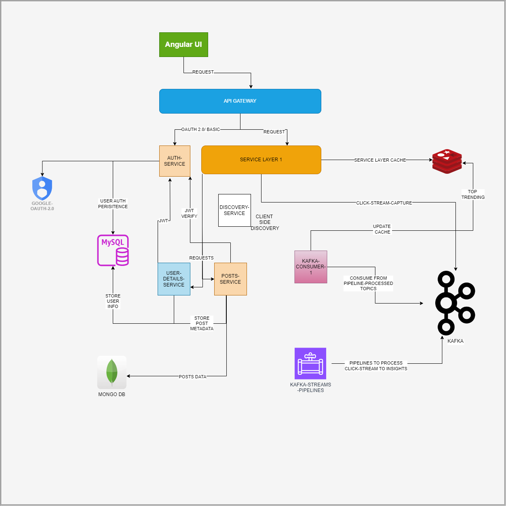

# PTHORE - progress-thoughts-relentlessly
## STATUS: drafting README, project: wip
## CONTENTS: 
- Introduction and Problems
- Features
- High level architecture

### Introduction and problem
The name speaks for itself, 'progress thoughts relentlessly', The project initially started with an intent to do something that helps people to learn a lot of new things, so started off as a blogging web app, but later with discussing with people around, the project evolved to being something more, A space where the information could pass globally and also within the boundary of a team or organization or just for private use.

The goal of the application is to provide e-space for individuals, teams, business to create and share blogs, announcements, documentation, HR communications as posts.
### Features
- lets you create insightful posts using images, text paragraphs, links, code.
- you can follow people like any other blogging / social media apps nowadays.
- you can like and delve into comments and replies on any visible post.
- you can follow domains of your interest and you will find suggestion according to your interests.
- you get to see the top 20 most trending Posts in different domains, top domains that are catching the interest of readers, top readers in our app and so many more insights. 
- you can login with your basic info or you can use google to authenticate and login as user.
- you can build and engage with audience | followers through your own profile with display picture, bio , contact details.
- You can also search for any title | author | domains | or simply anything, if related posts exist in our catalog we will display most accurate search result for you.
  
### High level architecture and diagram

